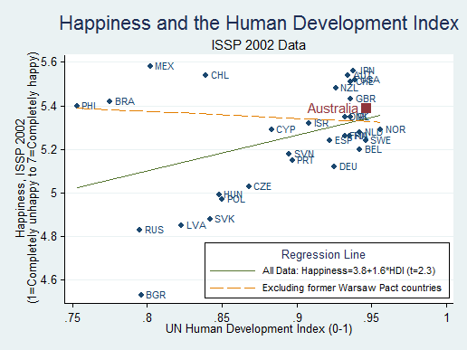
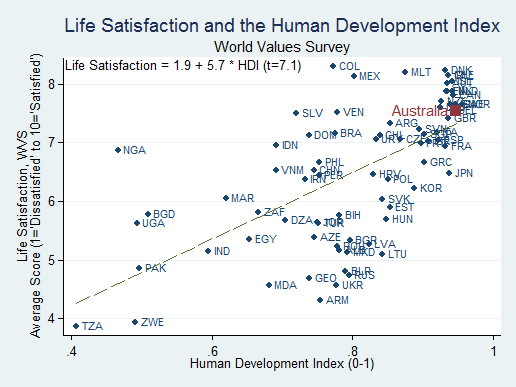
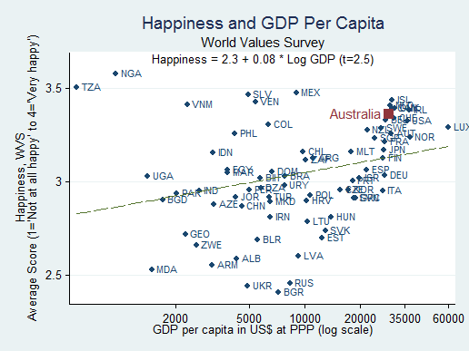
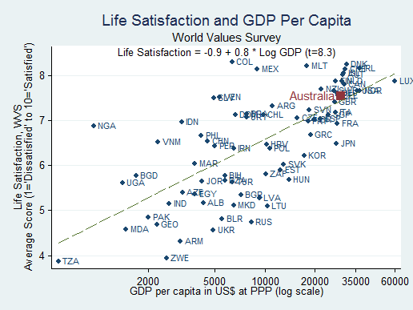

<a href="README.tr.md"><b>🇹🇷 Türkçe</b></a>

# Applied Econometrics Coursework

**Marmara University** — English Economics Program (2020–2021)

---

## Featured Projects

### [📄 CCI and Economic Growth](./stata/cci-economic-growth) — *Research Paper*
> **Co-authored · 17 pages · Stata**

Does the Consumer Confidence Index affect GDP growth? Full empirical analysis of OECD countries (2019), controlling for FDI, interest rates, and unemployment. Complete with OLS regression, robust standard errors, RESET test, Breusch-Pagan test, and information matrix test.

→ **[Read the paper (PDF)](./stata/cci-economic-growth/report/report.pdf)** · [Analysis script](./stata/cci-economic-growth/analysis.do) · [Data](./stata/cci-economic-growth/data)

 

### [🇦🇺 Revisiting the Australia Happiness Paradox](./stata/australia-happiness-paradox) — *Replication Study*
> **5 figures · Detailed commentary · Stata**

Replication of Blanchflower & Oswald's paradox using ISSP and WVS data. Is Australia unhappy relative to its HDI and GDP? We find the opposite — Australia is consistently *above* the regression line. Norway is the real puzzle.

| | |
|:---:|:---:|
|  |  |
| Happiness vs HDI (ISSP 2002) | Life Satisfaction vs HDI (WVS) |
|  |  |
| Happiness vs GDP per capita | Life Satisfaction vs GDP per capita |

→ **[Read the report (PDF)](./stata/australia-happiness-paradox/report.pdf)** · [Analysis script](./stata/australia-happiness-paradox/analysis.do) · [Reference paper](./stata/australia-happiness-paradox/reference.pdf)

 

### [🎤 Chapter 22 Presentation: Creating Dynamic Reports](./r/dynamic-reports-presentation) — *Class Presentation*
> **Presented in class · Spring 2021 · ~200 lines of original code**

End-of-semester chapter presentation based on **R in Action (2nd Ed.)** by Kabacoff. Prepared and delivered to the class as the final assignment for the R semester.

**What's covered:**

| Topic | Technology |
|---|---|
| Web reports | `rmarkdown` (HTML) |
| Publication-ready PDF | `knitr` + LaTeX |
| Interactive dashboards | `flexdashboard` |
| Reactive web apps | `shiny` + `shinydashboard` (3 examples) |
| Microsoft Word integration | `R2wd` + `RDCOMClient` |

**Beyond the book:** RDCOMClient troubleshooting guide, flexdashboard vs shinydashboard comparison table, curated live demo links, 3 complete shinydashboard examples (blank → basic → advanced).

→ **[Presentation script (205 lines)](./r/dynamic-reports-presentation/presentation.R)** · [Original book source](https://github.com/kabacoff/RiA2/blob/master/Ch22%20Creating%20dynamic%20Reports.R) · [All files](./r/dynamic-reports-presentation)

---

## More Projects

### [Determinants of GDP Growth](./stata/gdp-growth-determinants) — Stata
Cross-country OLS regression with World Bank data. Two competing models compared — 6 regressors vs 3 — with full diagnostic suite. Model 2 wins on sample size and joint significance (p=0.004).

→ [Script](./stata/gdp-growth-determinants/analysis.do)

### [UK vs USA: Penn World Table](./r/pwt-country-comparison) — R
Comparative analysis using PWT 8.0. Descriptive statistics, `ggplot2` time-series charts, and an interactive **googleVis** world map.

→ [Script](./r/pwt-country-comparison/analysis.R)

### [Coursework vs Exam Performance](./r/regression-analysis) — R
Linear regression with prediction and Breusch-Pagan heteroscedasticity test.

→ [Script](./r/regression-analysis/analysis.R)

### [Dynamic Reports with R Markdown](./r/dynamic-reports) — R
Reproducible research pipeline: `.Rmd` → PDF via `knitr` + `stargazer`.

→ [Source](./r/dynamic-reports/article.Rmd) · [PDF output](./r/dynamic-reports/article.pdf)

---

| Semester | Tool | Focus |
|----------|------|-------|
| Fall 2020 | **Stata** | Panel data · OLS · Diagnostics · Hypothesis testing |
| Spring 2021 | **R** | ggplot2 · googleVis · rmarkdown · shiny · flexdashboard · lmtest |
