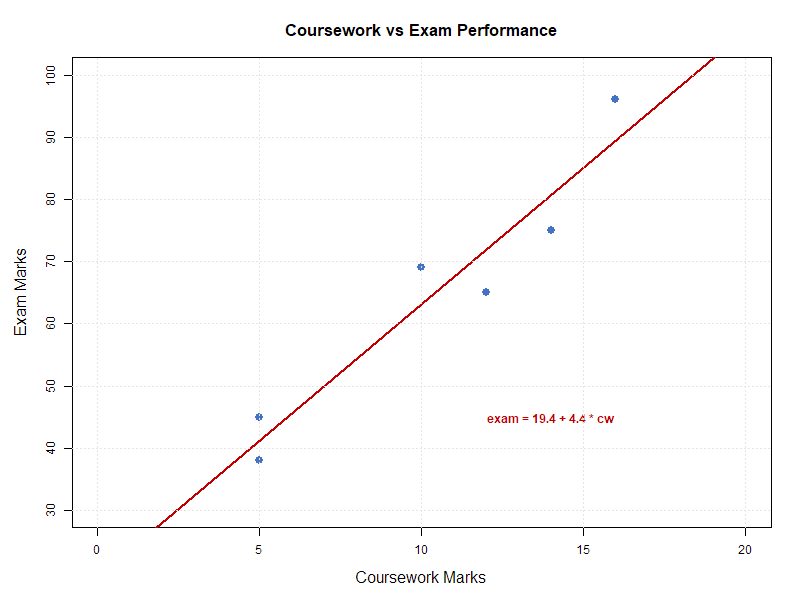

# Coursework vs Exam Performance

Linear regression analysis of the relationship between coursework and exam marks.

---

## Regression

```
exam = 2.2 + 6.6 * cw
```

The slope suggests each additional coursework mark is associated with a 6.6-point increase in the exam score.

## Scatterplot with Fitted Line



## Diagnostics

- **Breusch-Pagan test** — p = 0.497, no evidence of heteroscedasticity
- **Prediction** — full coursework marks (20/20) predicts 107.0 on exam (>100 max), suggesting model limitations at extremes
- **Multicollinearity** — not applicable (single predictor)

## Files

| File | Description |
|------|-------------|
| [analysis.R](analysis.R) | R script with full analysis and commentary |
| [scatterplot.png](scatterplot.png) | Generated output |

## Tools

`lm()` · `fitted()` · `predict()` · `bptest()` (lmtest) · `ggplot2` · `vapoRwave`
